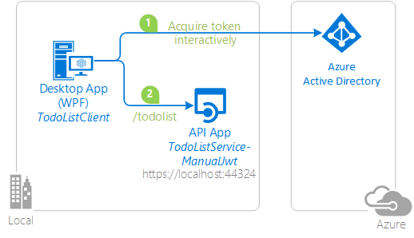

# Manually validating a JWT access token in a web API


## About this sample

This sample demonstrates how to manually process a JWT access token in a web API using the JSON Web Token Handler For the Microsoft .Net Framework 4.5.  This sample is equivalent to the [NativeClient-DotNet](https://github.com/Azure-Samples/active-directory-dotnet-native-desktop) sample, except that, in the ``TodoListService``, instead of using OWIN middleware to process the token, the token is processed manually in application code.  The client, which demonstrates how to acquire a token for this protected API, is unchanged from the [NativeClient-DotNet](https://github.com/Azure-Samples/active-directory-dotnet-native-desktop) sample.



## Scenario: protecting a Web API - acquiring a token for the protected Web API

When you want to protect a Web API, you request your clients to get a [Security token](https://docs.microsoft.com/en-us/azure/active-directory/develop/active-directory-dev-glossary#security-token) for your API, and you validate it. Usually, for ASP.NET applications this validation is delegated to the OWIN middleware, but you can also validate it yourself, leveraging the ``System.IdentityModel.Tokens.Jwt`` library.

### Token Validation

A token represents the outcome of an authentication operation with some artifact that can be unambiguously tied to the Identity Provider that performed the authentication, without relying on any special network infrastructure.

With Azure Active Directory taking the full responsibility of verifying user's raw credentials, the token receiver's responsibility shifts from verifying raw credentials to verifying that their caller did indeed go through your identity provider of choice and successfully authenticated. The identity provider represents successful authentication operations by issuing a token, hence the job now becomes to validate that token.

### Validating the claims

When an application receives an ID token upon user sign-in, it should also perform a few checks against the claims in the ID token. These include but are not limited to:

- **audience** claim, to verify that the ID token was intended to be given to your application
- **not before** and "expiration time" claims, to verify that the ID token has not expired
- **issuer** claim, to verify that the token was issued to your app by the v2.0 endpoint
- **nonce**, as a token replay attack mitigation

You are advised to use standard library methods like [JwtSecurityTokenHandler.ValidateToken Method (JwtSecurityToken)](https://msdn.microsoft.com/en-us/library/dn451163(v=vs.114).aspx) to do most of the aforementioned heavy lifting. You can further extend the validation process by making decisions based on claims recieved in the token. For example, multi-tenant applications can extend the standard validation by inspecting value of the ``tid`` claim (Tenant Id) against a set of pre-selected tenants to ensure they only honor token from tenants of their choice. Details on the claims provided in JWT tokens is listed in the [Azure AD token reference](https://docs.microsoft.com/en-us/azure/active-directory/develop/active-directory-token-and-claims). When you debug your application and want to understand the claims held by the token you might find it useful to use the [JWT token inspector](https://jwt.ms) tool.

> Looking for previous versions of this code sample? Check out the tags on the [releases](../../releases) GitHub page.

## How To Run This Sample

>[!Note] If you want to run this sample on **Azure Government**, navigate to the "Azure Government Deviations" section at the bottom of this page.

To run this sample you will need:

- [Visual Studio 2017](https://aka.ms/vsdownload)
- An Internet connection
- An Azure Active Directory (Azure AD) tenant. For more information on how to get an Azure AD tenant, please see [How to get an Azure AD tenant](https://azure.microsoft.com/en-us/documentation/articles/active-directory-howto-tenant/)
- A user account in your Azure AD tenant. This sample will not work with a Microsoft account, so if you signed in to the Azure portal with a Microsoft account and have never created a user account in your directory before, you need to do that now. This sample will not work with a Microsoft account (formerly Windows Live account).

### Step 1:  Clone or download this repository

From your shell or command line:

`git clone https://github.com/Azure-Samples/active-directory-dotnet-webapi-manual-jwt-validation.git`

> Given that the name of the sample is pretty long, and so are the name of the referenced NuGet pacakges, you might want to clone it in a folder close to the root of your hard drive, to avoid file size limitations on Windows.

### Step 2:  Register the sample with your Azure Active Directory tenant

here are two projects in this sample. Each needs to be separately registered in your Azure AD tenant. To register these projects you can:

- either follow the steps in the paragraphs below (Step 2 and Step 3)
- or you can use PowerShell scripts which automatically create for you the Azure AD applications and related objects (passwords, permissions, dependencies) and modify the projects' configuration files. If you want to do use this automation, read the instructions in [App Creation Scripts](./AppCreationScripts/AppCreationScripts.md)

#### Register the TodoListService-ManualJwt web API

1. Sign in to the [Azure portal](https://portal.azure.com).
2. On the top bar, click on your account and under the **Directory** list, choose the Active Directory tenant where you wish to register your application.
3. Click on **All Services** in the left hand nav, and choose **Azure Active Directory**.
4. Click on **App registrations** and choose **New application registration**.
5. Enter a friendly name for the application, for example 'TodoListService-ManualJwt' and select 'Web app / API' as the Application type. For the Sign-on URL, enter the base URL for the sample, which is by default `https://localhost:44324`. Click on **Create** to create the application.
6. In the succeeding page, Find the **Application ID** value and copy it to the clipboard.
7. Then click on **Settings** and choose **Properties**.
8. For the App ID URI, update the existing value https://\<your_tenant_name\>/TodoListService-ManualJwt by replacing \<your_tenant_name\> with the name of your Azure AD tenant.

#### Register the TodoListClient app

1. Sign in to the [Azure portal](https://portal.azure.com).
2. On the top bar, click on your account and under the **Directory** list, choose the Active Directory tenant where you wish to register your application.
3. Click on **All Services** in the left hand nav, and choose **Azure Active Directory**.
4. Click on **App registrations** and choose **New application registration**.
5. Enter a friendly name for the application, for example 'TodoListClient-DotNet' and select 'Native' as the Application Type. For the redirect URI, enter `https://TodoListClient`. Please note that the Redirect URI will not be used in this sample, but it needs to be defined nonetheless. Click on **Create** to create the application.
6. In the succeeding page, Find the **Application ID** value and copy it to the clipboard.
7. Then click on **Settings** and choose **Properties**.
8. Configure Permissions for your application - in the Settings menu, choose the **Required permissions** section, click on **Add**, then **Select an API**, and type 'TodoListService' in the textbox and hit enter. Select 'TodoListService-ManualJwt' from the results and click the 'Select' button. Then, click on  **Select Permissions** and select 'Access TodoListService-ManualJwt'. Click the 'Select' button again to close this screen. Click on **Done** to finish adding the permission.

### Step 3:  Configure the sample to use your Azure AD tenant

#### Configure the TodoListService-ManualJwt project

1. Open the solution in Visual Studio.
2. Open the `web.config` file.
3. Find the app key `ida:Tenant` and replace the value with your AAD tenant name.
4. Find the app key `ida:Audience` and replace the value with the App ID URI you registered earlier, for example `https://<your_tenant_name>/TodoListService-ManualJwt`.
5. Find the app key `ida:ClientId` and replace the value with the **Application ID** (also named Clientid) you copied earlier to the clipboard for this service application.

#### Configure the TodoListClient project

1. Open `app.config`.
2. Find the app key `ida:Tenant` and replace the value with your AAD tenant name.
3. Find the app key `ida:ClientId` and replace the value with the Application ID (also named) Client ID for the TodoListClient from the Azure portal.
4. Find the app key `ida:RedirectUri` and replace the value with the Redirect URI for the TodoListClient from the Azure portal, for example `https://TodoListClient`.
5. Find the app key `todo:TodoListResourceId` and replace the value with the App ID URI of the TodoListService-ManualJwt project, for example `https://<your_tenant_name>/TodoListService-ManualJwt`
6. Find the app key `todo:TodoListBaseAddress` and replace the value with the base address of the TodoListService-ManualJwt project, for example `https://localhost:44324`.

### Step 4:  Run the sample

Clean the solution, rebuild the solution, and run it. You might want to go into the solution properties and set both projects as startup projects, with the service project starting first.

Explore the sample by signing in, adding items to the To Do list, removing the user account, and starting again.  Notice that if you stop the application without removing the user account, the next time you run the application you won't be prompted to sign-in again - that is the sample implements a persistent cache for ADAL, and remembers the tokens from the previous run.

## About The Code

The manual JWT validation occurs in the [TokenValidationHandler](https://github.com/Azure-Samples/active-directory-dotnet-webapi-manual-jwt-validation/blob/master/TodoListService-ManualJwt/Global.asax.cs#L58) implementation in the `Global.aspx.cs` file in the TodoListService-ManualJwt project. Each time a call is done on a controller method holiding the `[Authorize]` attribute, the TokenValidationHandler.SendAsync method is called:
https://github.com/Azure-Samples/active-directory-dotnet-webapi-manual-jwt-validation/blob/4b80657c5506c8cb30af67b9f61bb6aa68dfca58/TodoListService-ManualJwt/Global.asax.cs#L80

This method:

1. gets the token from the Authorization headers
2. verifies that the token has not expired
3. gets the open id configuration from the Azure AD discovery endpoint
4. Sets the parameters to validate:

  - the audience - the application accepts both its App Id URI and its AppID/clientID
  - the valid issuers - the application accepts both Azure AD V1 and Azure AD V2

5. Then it delegates to the `JwtSecurityTokenHandler` class (provided by the `System.IdentityModel.Tokens` library)

the `TokenValidationHandler` class is registered with ASP.NET in the `TodoListService-ManualJwt/Global.asx.cs` file, in the `application_start()` method :
https://github.com/Azure-Samples/active-directory-dotnet-webapi-manual-jwt-validation/blob/4b80657c5506c8cb30af67b9f61bb6aa68dfca58/TodoListService-ManualJwt/Global.asax.cs#L54

## How To Recreate This Sample

First, in Visual Studio 2017 create an empty solution to host the projects.  Then, follow these steps to create each project.

### Creating the TodoListService-ManualJwt Project

1. In Visual Studio , create a new `Visual C#` `ASP.NET Web Application (.NET Framework)`. Choose `Web Api` in the next screen. Leave the project's chosen authentication mode as the default, i.e. `No Authentication`".
2. Set SSL Enabled to be True. Note the SSL URL.
3. In the project properties, Web properties, set the Project Url to be the SSL URL.
4. Add the latest stable JSON Web Token Handler For the Microsoft .Net Framework 4.5 NuGet, System.IdentityModel.Tokens.Jwt, version 4.x to the project.  Note:  Version 5.x will not work with this sample.
5. Add an assembly reference to `System.IdentityModel`.
6. In the `Models` folder add a new class called `TodoItem.cs`.  Copy the implementation of TodoItem from this sample into the class.
7. Add a new, empty, Web API 2 controller called `TodoListController`.
8. Copy the implementation of the TodoListController from this sample into the controller.
9. Open Global.asax, and copy the implementation from this sample into the controller.  Note that a single line is added at the end of `Application_Start()`,
      ```CSharp
      GlobalConfiguration.Configuration.MessageHandlers.Add(new TokenValidationHandler());
      ```
10. In `web.config` create keys for `ida:AADInstance`, `ida:Tenant`, and `ida:Audience` and set them accordingly.  For the public Azure cloud, the value of `ida:AADInstance` is `https://login.microsoftonline.com/{0}`.

### Creating the TodoListClient Project

1. In the solution, create a new Windows --> Windows Classic Desktop -> WPF App(.NET Framework)  called TodoListClient.
2. Add the (stable) Active Directory Authentication Library (ADAL) NuGet, `Microsoft.IdentityModel.Clients.ActiveDirectory`, version 1.0.3 (or higher) to the project.
3. Add  assembly references to `System.Net.Http`, `System.Web.Extensions`, and `System.Configuration`.
4. Add a new class to the project called `TodoItem.cs`.  Copy the code from the sample project file of same name into this class, completely replacing the code in the file in the new project.
5. Add a new class to the project called `FileCache.cs`.  Copy the code from the sample project file of same name into this class, completely replacing the code in the file in the new project.
6. Copy the markup from `MainWindow.xaml' in the sample project into the file of same name in the new project, completely replacing the markup in the file in the new project.
7. Copy the code from `MainWindow.xaml.cs` in the sample project into the file of same name in the new project, completely replacing the code in the file in the new project.
8. In `app.config` create keys for `ida:AADInstance`, `ida:Tenant`, `ida:ClientId`, `ida:RedirectUri`, `todo:TodoListResourceId`, and `todo:TodoListBaseAddress` and set them accordingly.  For the public Azure cloud, the value of `ida:AADInstance` is `https://login.microsoftonline.com/{0}`.

Finally, in the properties of the solution itself, set both projects as startup projects.

## Azure Government Deviations

In order to run this sample on Azure Government you can follow through the steps above with a few variations:

- Step 2:
  - You must register this sample for your AAD Tenant in Azure Government by following Step 2 above in the [Azure Government portal](https://portal.azure.us).
- Step 3:

  - Before configuring the sample, you must make sure your [Visual Studio is connected to Azure Government](https://docs.microsoft.com/azure/azure-government/documentation-government-get-started-connect-with-vs).
  - Navigate to the Web.config file. Replace the `ida:AADInstance` property in the Azure AD section with `https://login.microsoftonline.us/`.

Once those changes have been accounted for, you should be able to run this sample on Azure Government.

## Troubleshooting

If you are using this sample with an Azure AD B2C custom policy, you might want to read #22, and change step 3. in the [About the code](About-the-code) paragraph.

## More information

For more information on how to acquire a token in the client application, see ADAL.NET's conceptual documentation:

- [Recommanded pattern to acquire a token](https://github.com/AzureAD/azure-activedirectory-library-for-dotnet/wiki/AcquireTokenSilentAsync-using-a-cached-token#recommended-pattern-to-acquire-a-token)

For more information about token validation, see:

- [JwtSecurityTokenHandler.ValidateToken Method (JwtSecurityToken)](https://msdn.microsoft.com/en-us/library/dn451163(v=vs.114).aspx)
- [Principles of Token Validation](http://www.cloudidentity.com/blog/2014/03/03/principles-of-token-validation/)

For more information about how the protocols work in this scenario and other scenarios, see [Authentication Scenarios for Azure AD](http://go.microsoft.com/fwlink/?LinkId=394414).